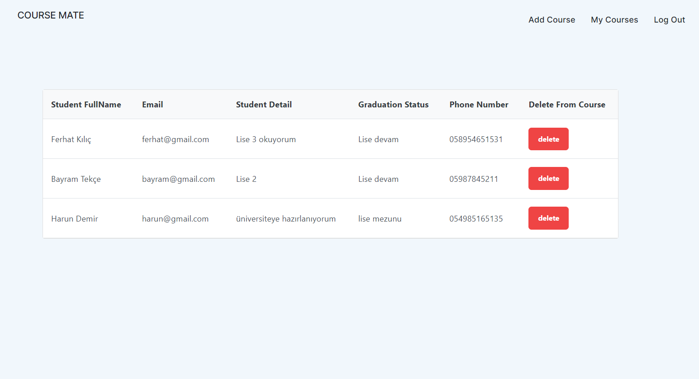

### PROJECT AND USED TECHNOLOGIES
The Course Mate project is an initiative that brings students and teachers together on a digital platform. While teachers can create various courses according to their interests, students can attend these courses and get support on the issues they lack. The project brings together people from different cultures by creating a global community while offering flexible learning opportunities

The project utilizes MS SQL Server as its database management system, while the backend is developed using .NET Core. The frontend, on the other hand, is built using the Angular technology.

Link of Backend codes : <https://github.com/eyupduran/Course-Mate-Be>

### INTRODUCTION OF THE PROJECT

The project involves two distinct user types: students and instructors, each possessing unique capabilities. Instructors initially register and log in to the platform, after which they can add courses to the system aligned with their areas of expertise and interests. These courses can encompass a wide array of subjects, thus providing students with a rich selection. Once instructors have uploaded their courses onto the system, they can view and manage them. Detailed course pages present comprehensive content overviews, allowing potential students to gain an in-depth understanding. These pages also enable instructors to view lists of enrolled students. Instructors possess the ability to individually assess students and, if necessary, remove a student from their course, thereby ensuring continual monitoring of course quality and effectiveness.

On the other hand, student users have the opportunity to enhance their understanding of subjects or topics where they lack proficiency through a broad range of courses available on the platform. Students can easily identify their areas of weakness from the course list and explore offerings from instructors who specialize in those fields. By purchasing a course they find appealing, students can personalize their learning journeys. The courses they've acquired are visible on their profiles, granting them constant access for tracking and monitoring. Similar to the view instructors have of their course details, students can comprehensively monitor their course content and progress.

The primary objective of this project is to unite instructors and students to enhance the learning experience in a more effective and customized manner. Instructors can share their expertise and guide students in areas where they require improvement. Simultaneously, students can select courses tailored to their individual needs, enabling them to progress at their own pace. The platform aims to provide both user types with flexibility and user-friendliness, ultimately making the education experience more accessible and impactful.
### USER INTERFACE AND APPLICATION HOW IT WORKS

##### STUDENT REGISTER PAGE
This web page provides a platform for users with a student profile to register. The registration process is completed by transferring personal information and parts about studentship to the system via the form found here. This registration page is designed to enable easy and effective system integration. 

##### TEACHER REGISTER PAGE
This web page provides a special area for users associated with the instructor profile to register. Through the form here, trainers complete the registration process by submitting their credentials and important details about their teaching abilities to the system. The purpose of this registration page is to ensure that instructors integrate easily into the system, while allowing them to best reflect the expertise and experience they offer. 

##### LOGIN PAGE
Users who have registered to the system before use the login page to log in to the system. Users who have successfully logged in are directed to the product list page as the home page. In this process, an encrypted JWT containing the user's information and authorizations is generated and this token is added to the local storage, which is the local storage area of the web browser.

While this mechanism facilitates the authentication process of users, it also ensures the security of user data. Because the JWT token has an encrypted structure, user information is securely transported and protected against manipulation. In this way, unauthorized access to the system is prevented and the confidentiality of user data is ensured.

##### COURSE LIST PAGE
On this web page, all courses are comprehensively displayed along with course information. Students are offered the opportunity to enroll in courses by reviewing course information and browsing the details. One of the highlights of this platform is that students have the option to enroll in courses even if the course capacity is more than 1. One aspect that should be particularly emphasized is that teachers have the authority to review the courses offered; but their lack of ability to purchase courses. This design provides students with the convenience of discovering and selecting courses according to their preferences, while ensuring that teachers can interact with course content without admin access.

##### ENROLLED COURSE PAGE
This page provides a platform where users with a student profile can monitor the courses they have purchased, the course instructor, and other relevant details. Here students can find necessary information about the courses they have. The instructor of the course, its content and other details are among the information provided to the students. This page aims to make their educational experience richer and more informative by providing students with enhanced viewing and access to the courses they have.

##### ADD COURSE PAGE
This special page represents a platform where users with an instructor profile can create new course enrollments by adding their own courses and details about those courses. Here, instructors can create courses suitable for their area of expertise and enter the details of these courses. The course name, content, duration, dates and other important information can be found on this page. This customized page allows instructors to easily create and manage their own course content, aiming to present training materials effectively.

##### MY COURSES PAGE
This customized page provides a platform with details of courses created by users with an instructor profile. On this page, besides the information about the courses opened by the instructors, it is also possible to view how many students purchased each course. Important information such as the course name, content, duration, dates as well as the number of students who purchased the course is presented on this page. This design aims to help instructors better optimize their training content by enabling them to monitor the popularity and impact of their courses.

##### COURSE DETAIL PAGE
Users with an instructor profile can access this page when they click the "Detail" button in the course list on the "My Courses" page. In addition to the details of the relevant course, this special page displays a list of students who have purchased that course and other relevant information. In addition to information such as the name, content and duration of the course, the names or identities of the students who purchased the course can also be included on this page. This arrangement aims to help instructors manage their educational experience more effectively by giving them the opportunity to better understand the level of engagement and engagement of their courses.

#### ADMIN PAGES
These pages are only open to users with an administrator (admin) profile. Users with student and instructor profiles are listed in special lists on two separate pages. The administrator user can review the users and related details in these lists, and has the ability to delete users when necessary. This arrangement provides a structure in which the administrator user is equipped with full control and management authority over the platform, allowing them to manage user accounts effectively.

##### STUDENT LIST PAGE

##### TEACHER LIST PAGE

### ACCESS SECURITY TO PAGES 
Users of all types can only access pages where they can have a job. In order to achieve this, separate guards have been created for each user type on the frontend, namely angular. These guards control the user's role and privileges, allowing the user to access only the pages within their authorization.

